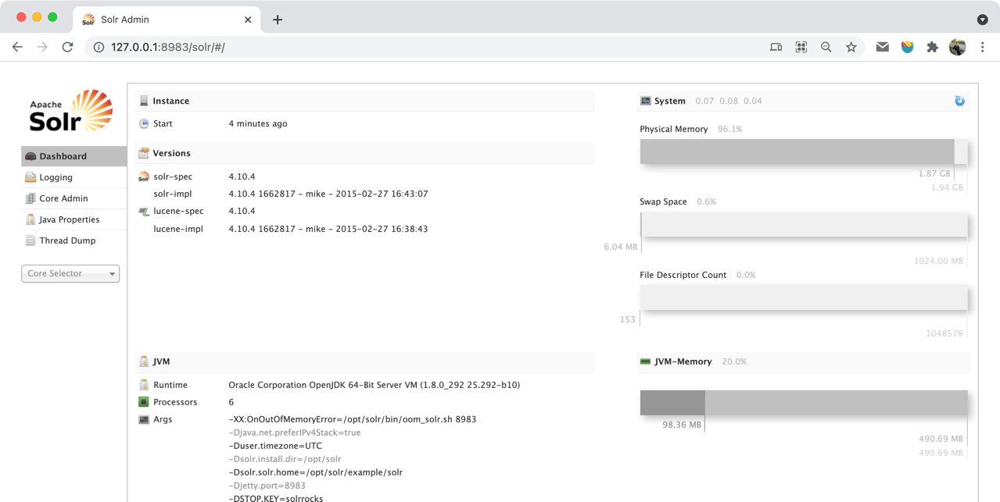

# README

Export documents from a SOLR index as JSON, fast and simply from the command line.

## Requirements

SOLR 4.7 or higher, since the cursor mechanism
introduced ([2014-02-25](https://archive.apache.org/dist/lucene/solr/4.7.0/)) &mdash; see
also [efficient deep paging with cursors](https://solr.pl/en/2014/03/10/solr-4-7-efficient-deep-paging/).

## Installation

1. Via debian or rpm [package](https://github.com/gobars/solrdump/releases).
2. Or via go tool: `go install github.com/gobars/solrdump@latest`

## Features

1. `_version_` deleted from the result
2. `output="http://127.0.0.1:9092/zz/docs?routing=@path"` `@path` in the url will be evaluated by `{GjsonPath}`
   , [Syntax](https://github.com/bingoohuang/jj/blob/master/SYNTAX.md)
3. `output="http://127.0.0.1:9092/zz/_bulk?routing=@path"` will change to bulk mode for elasticsearch automatically.

## Usage

```shell
Usage of solrdump (0.1.2):
  -max int       Max number of rows (default 100)
  -q string      SOLR query (default "*:*")
  -rows int      Number of rows returned per request (default 100)
  -server string SOLR server with index name, eg. localhost:8983/solr/example
  -version       Show version and exit
  -remove-fields Remove fields, _version_ defaulted
  -output        Output file, or http url, or noop
  -v             Verbose, -v -vv -vvv
```

### Print docs

```shell
$ solrdump -server 192.168.2.6:8983/solr/zz -max 3          
2021/06/03 17:57:50 http://192.168.2.6:8983/solr/zz/select?cursorMark=%2A&fl=&q=%2A%3A%2A&rows=3&sort=id+asc&wt=json
{"dataType":"INTEGRATION","id":"000007c8-3d83-47c7-b9f0-1e0d15670599","createdDate":"2020-08-06T06:49:37Z"}
{"dataType":"MANUAL","id":"00004d53-d76d-43c3-906d-90ff475bd1a2","createdDate":"2021-05-10T08:14:14Z"}
{"dataType":"MANUAL","id":"000070fe-309f-4755-998e-2445cc66ef9f","createdDate":"2021-05-10T08:14:14Z"}
2021/06/03 17:57:50 fetched 3/509309 docs
```

### Write to elastic search

```sh
$ solrdump -server 192.168.2.6:8983/solr/licenseIndex -max 10 -vv -output "192.168.2.8:9202/license/docs?routing=@holderIdentityNum.0"
2021/06/08 14:30:53 started
2021/06/08 14:30:58 fetched 10/509311 docs
2021/06/08 14:30:58 solr query: "http://192.168.2.6:8983/solr/licenseIndex/select?cursorMark=*&fl=&q=*:*&rows=10&sort=id asc&wt=json"
2021/06/08 14:30:58 http uri: http://192.168.2.8:9202/license/docs?routing=441421201510165436
2021/06/08 14:30:58 sent cost: 5.175523ms status: 201, body: {"_index":"license","_type":"docs","_id":"rB1R6nkBuRYpTrL3HTzU","_version":1,"result":"created","_shards":{"total":1,"successful":1,"failed":0},"_seq_no":30989363,"_primary_term":3}
2021/06/08 14:31:03 process 10 docs, rate 0.999881 docs/s, cost 10.001191743s
```

then [elasticsearch query on 441421201510165436](http://192.168.2.8:9202/license/_search?routing=441421201510165436&q=holderIdentityNum:441421201510165436)
can be performed.

## Resources

1. [o19s/solr-to-es](https://github.com/o19s/solr-to-es)
2. [solr cursor select query](https://github.com/frizner/glsolr)
3. [frizner/solrdump](https://github.com/frizner/solrdump)
4. [hectorcorrea/solr-for-newbies](https://github.com/hectorcorrea/solr-for-newbies)
5. [online json-generator](https://www.json-generator.com)
6. [SOLR bash recipes for creating, deleting or truncating collections, monitoring and searching](https://gist.github.com/CesarCapillas/a796c0e7cba10ac02213c7f3485d6e90#file-delete-by-id-sh)
7. [Deleting documents in SOLR](https://www.zylk.net/en/web-2-0/blog/-/blogs/deleting-documents-in-solr)
    ```sh
     Via post command:
     $ post -c gettingstarted -d '<delete><id>44C</id></delete>'
     
     Via REST API:
     
     $ curl -X POST "http://localhost:8983/solr/gettingstarted/update?commit=true" -H "Content-Type: text/xml" --data-binary "<delete><id>44C</id></delete>"
     $ curl -X POST "http://localhost:8983/solr/gettingstarted/update?commit=true" -H "Content-Type: application/json" --data-binary '{"delete": {"id":"44C"}}'
     
     You may find more scripts in my gist (delete-by-id.sh, delete-by-id2.sh & delete-by-id3.sh)

     Note: Tested in SOLR 6.6 (Cloud)
    ```

## Pagination of Results

* https://cwiki.apache.org/confluence/display/solr/Pagination+of+Results

Requesting large number of documents from SOLR can lead to *Deep Paging*
problems:

> When you wish to fetch a very large number of sorted results from Solr to
> feed into an external system, using very large values for the start or rows
> parameters can be very inefficient.

See also: *Fetching A Large Number of Sorted Results: Cursors*

> As an alternative to increasing the "start" parameter to request subsequent
> pages of sorted results, Solr supports using a "Cursor" to scan through
> results. Cursors in Solr are a logical concept, that doesn't involve caching
> any state information on the server. Instead the sort values of the last
> document returned to the client are used to compute a "mark" representing a
> logical point in the ordered space of sort values.

`http://192.168.2.6:8983/solr/zz/select?q=*:*&wt=json&cursorMark=*&sort=id asc`

```json
{
  "responseHeader": {
    "status": 0,
    "QTime": 13,
    "params": {
      "q": "*:*",
      "cursorMark": "*",
      "sort": "id asc",
      "wt": "json"
    }
  },
  "response": {
    "numFound": 509309,
    "start": 0,
    "docs": [
      {
        "name": "测试",
        "id": "00013dd9-7326-43d7-977d-60cdab8deb95",
        "createdBy": "4f070706-c30c-481c-a837-9f39136c62de",
        "createdDate": "2021-05-10T08:14:14Z",
        "lastModifiedBy": "4f070706-c30c-481c-a837-9f39136c62de",
        "lastModifiedDate": "2021-05-28T04:33:22Z",
        "_version_": 1700975244065374200
      }
    ]
  },
  "nextCursorMark": "AoE/BTAwMDEzZGQ5LTczMjYtNDNkNy05NzdkLTYwY2RhYjhkZWI5NQ=="
}
```

```sh
$ gurl 192.168.126.16:8983/solr/licenseIndex/select q=='*:*' sort=='id asc' rows==10 wt==json fl==id cursorMark=="*"
GET /solr/licenseIndex/select?sort=id+asc&rows=10&wt=json&fl=id&cursorMark=%2A&q=%2A%3A%2A HTTP/1.1
Host: 192.168.126.16:8983
Accept: application/json
Accept-Encoding: gzip, deflate
Content-Type: application/json
User-Agent: gurl/0.1.0

HTTP/1.1 200 OK
Server: Apache-Coyote/1.1
Content-Type: text/plain;charset=UTF-8
Date: Thu, 16 Sep 2021 02:28:44 GMT

{"responseHeader":{"status":0,"QTime":15,"params":{"q":"*:*","fl":"id","cursorMark":"*","sort":"id asc","rows":"10","wt":"json"}},"response":{"numFound":509327,"start":0,"docs":[{"id":"000007c8-3d83-47c7-b9f0-1e0d15670599"},{"id":"00004d53-d76d-43c3-906d-90ff475bd1a2"},{"id":"000070fe-309f-4755-998e-2445cc66ef9f"},{"id":"0000744c-47dc-4c25-a63f-8132525a8cdf"},{"id":"0000ac46-3961-4fd4-aad6-25359cc382c5"},{"id":"0000e7c5-4994-415a-88ae-6abd0b300cb7"},{"id":"0001036a-226b-4bd9-b360-332d8cd10eed"},{"id":"00011136-8afa-47a8-953b-e8422854202e"},{"id":"00013d4c-7eda-4d3e-8b10-9d92be1b9739"},{"id":"00013dd9-7326-43d7-977d-60cdab8deb95"}]},"nextCursorMark":"AoE/BTAwMDEzZGQ5LTczMjYtNDNkNy05NzdkLTYwY2RhYjhkZWI5NQ=="}

$ gurl 192.168.126.16:8983/solr/licenseIndex/select q=='*:*' sort=='id asc' rows==10 wt==json fl==id cursorMark=="AoE/BTAwMDEzZGQ5LTczMjYtNDNkNy05NzdkLTYwY2RhYjhkZWI5NQ=="
GET /solr/licenseIndex/select?cursorMark=AoE%2FBTAwMDEzZGQ5LTczMjYtNDNkNy05NzdkLTYwY2RhYjhkZWI5NQ%3D%3D&q=%2A%3A%2A&sort=id+asc&rows=10&wt=json&fl=id HTTP/1.1
Host: 192.168.126.16:8983
Accept: application/json
Accept-Encoding: gzip, deflate
Content-Type: application/json
User-Agent: gurl/0.1.0

HTTP/1.1 200 OK
Server: Apache-Coyote/1.1
Content-Type: text/plain;charset=UTF-8
Date: Thu, 16 Sep 2021 02:28:54 GMT

{"responseHeader":{"status":0,"QTime":16,"params":{"q":"*:*","fl":"id","cursorMark":"AoE/BTAwMDEzZGQ5LTczMjYtNDNkNy05NzdkLTYwY2RhYjhkZWI5NQ==","sort":"id asc","rows":"10","wt":"json"}},"response":{"numFound":509327,"start":0,"docs":[{"id":"000152b0-e396-4fe8-96ec-20e851a11bb2"},{"id":"000176ab-2095-49eb-9346-77dae9937dab"},{"id":"00017f51-5618-4ce5-a2a2-9052c2d667cc"},{"id":"0001d75d-11ca-47a4-8b3a-5ec9f4860b74"},{"id":"00021e28-717e-41c3-a528-b54ea22877d8"},{"id":"000256ef-54c6-4f59-ba3e-840b039b3a47"},{"id":"0002a922-bc90-44b0-94ba-2dddaec402c5"},{"id":"0002d485-301f-406c-9d4f-79f85762d9b9"},{"id":"0002ed4f-3275-4e05-8a45-1f43bae361af"},{"id":"0002fe77-f4c8-4b1d-ac96-d9d89e3e5c32"}]},"nextCursorMark":"AoE/BTAwMDJmZTc3LWY0YzgtNGIxZC1hYzk2LWQ5ZDg5ZTNlNWMzMg=="}
```
## Docker

### Solr Docker

1. `docker pull geerlingguy/solr:4.10.4` [geerlingguy/solr](https://hub.docker.com/r/geerlingguy/solr)
2. `docker run -d --name=solr -p 8983:8983 geerlingguy/solr:4.10.4 /opt/solr/bin/solr start -p 8983 -f`
3. http://127.0.0.1:8983/solr/#/
   
4. POST requests
    ```http
    POST /solr/collection1/update?commitWithin=1000 HTTP/1.1
    Host: 127.0.0.1:8983
    Content-Type: application/json
    Content-Length: 814
    
    [
        {
            "id": "60bad0a3f46639d20ed3e854",
            "index_i": 0,
            "guid_s": "5e0abb5b-d324-4637-a11e-98a33afc2de1",
            "isActive_b": true,
            "balance_s": "$2,107.27",
            "picture_s": "http://placehold.it/32x32",
            "age_i": 25,
            "eyeColor_s": "green",
            "name_s": "Aline Wiley",
            "gender_s": "female",
            "company_s": "EURON",
            "email_s": "alinewiley@euron.com",
            "phone_s": "+1 (844) 431-2077",
            "address_s": "238 Alabama Avenue, Fillmore, South Dakota, 6551",
            "about_s": "Dolor adipisicing duis anim anim veniam nulla nostrud nulla",
            "registered_s": "2017-11-29T06:18:46 -08:00",
            "greeting_s": "Hello, Aline Wiley! You have 1 unread messages.",
            "favoriteFruit_s": "apple"
        }
    ]
   
    HTTP/1.1 200 OK
    Content-Type: text/plain;charset=UTF-8
    Transfer-Encoding: chunked
    
    {"responseHeader":{"status":0,"QTime":3}}
    ```
5. QUERY: http://localhost:8983/solr/collection1/select?q=*%3A*&rows=1000&wt=json&indent=true

### Elasticsearch docker

1. `docker pull elasticsearch:7.13.1`
   , [docker hub](https://hub.docker.com/_/elasticsearch?tab=description&page=1&ordering=last_updated)
2. `$ docker run -d --name elasticsearch -p 9200:9200 -p 9300:9300 -e "discovery.type=single-node" elasticsearch:7.13.1`
3. [chrome extension ElasticSearch Head](https://chrome.google.com/webstore/detail/elasticsearch-head/ffmkiejjmecolpfloofpjologoblkegm)
   , type in `http://127.0.0.1:9200/`

## FAQ

1. [How to insert data to solr collection using Postman?](https://stackoverflow.com/a/49179604)
    - POST request to http://localhost:8983/solr/[collection_name]/update?commitWithin=1000
    - Add the header Content-Type: application/json
    - Make sure to create a json array for multiple documents

    ```json
    [ { "name": "John", "age": 30, "cars": "BMW" }, { "name": "Harry", "age": 30, "cars": "BMW" }, { "name": "Pinku", "age": 30, "cars": "BMW" } ]
    ```
2. [Deleting documents in SOLR](https://gist.github.com/CesarCapillas/a796c0e7cba10ac02213c7f3485d6e90#file-delete-by-id-sh)
    ```sh
    $ curl -X POST "http://127.0.0.1:8983/solr/collection1/update?commit=true&wt=json" -H "Content-Type: text/xml" --data-binary "<delete><id>60bad0a3f46639d20ed3e855</id></delete>"
    {"responseHeader":{"status":0,"QTime":10}}
    ```
3. [ElasticSearch bulk api](https://www.elastic.co/guide/en/elasticsearch/reference/current/docs-bulk.html)
    ```http
    POST /zz/_bulk HTTP/1.1
    Host: 192.168.2.8:9202
    Content-Type: application/json
    Content-Length: 214
    
    { "index" : { "_type" : "docs","_routing":1 } }
    { "zzCode": 1, "field1" : "value10","field2" : "value20" }
    { "index" : { "_type" : "docs","_routing":2 } }
    { "zzCode": 2, "field1" : "value11","field2" : "value21" }
 
    ```

   response:

    ```json
    {"took":95,"errors":false,"items":[{"index":{"_index":"zz","_type":"docs","_id":"jSQE73kBuRYpTrL3mtJh","_version":1,"result":"created","_shards":{"total":2,"successful":2,"failed":0},"_seq_no":0,"_primary_term":1,"status":201}},{"index":{"_index":"zz","_type":"docs","_id":"jiQE73kBuRYpTrL3mtJh","_version":1,"result":"created","_shards":{"total":2,"successful":2,"failed":0},"_seq_no":0,"_primary_term":1,"status":201}}]}
    ```

   performance pk, 10000 dos, bulk mode use 1.7s other than 19s in normal one by one insert mode:

   ```sh
    # solrdump -server 192.168.2.6:8983/solr/licenseIndex -output "192.168.2.8:9202/license/docs?routing=@holderIdentityNum.0" -max 10000
    2021/06/09 13:20:05 started
    2021/06/09 13:20:15 fetched 10000/509311 docs
    2021/06/09 13:20:24 process 10000 docs, rate 517.326652 docs/s, cost 19.330146562s
    # solrdump -server 192.168.2.6:8983/solr/licenseIndex -output "192.168.2.8:9202/license/_bulk?routing=@holderIdentityNum.0" -max 10000
    2021/06/09 13:24:35 started
    2021/06/09 13:24:37 fetched 10000/509311 docs
    2021/06/09 13:24:37 process 10000 docs, rate 5784.721384 docs/s, cost 1.728691727s
    ```


### routing query in elasticsearch

`http://192.168.126.18:9202/license/_search?routing=619165199309043292&q=holderIdentityNum:619165199309043292`

```json
{
   "took": 515,
   "timed_out": false,
   "_shards": {
      "total": 1,
      "successful": 1,
      "skipped": 0,
      "failed": 0
   },
   "hits": {
      "total": 1,
      "max_score": 17.525234,
      "hits": [
         {
            "_index": "license",
            "_type": "docs",
            "_id": "FM8E1nkB5YDd59cjbRPT",
            "_score": 17.525234,
            "_routing": "619165199309043292",
            "_source": {
               "idCode": "4b00ff75-0c5b-4dfa-80e0-ae013dfc4371",
               "licenseCode": "4b00ff75-0c5b-4dfa-80e0-ae013dfc4371",
               "implementCode": "10003230100002888X110000",
               "name": "特困人员救助供养证",
               "licenseStatus": "ISSUED",
               "holderName": [
                  "王譺灋"
               ],
               "holderIdentityType": "10",
               "holderIdentityNum": [
                  "619165199309043292"
               ],
               "dataType": "INTEGRATION",
               "bizType": "LICENSE_ISSUE",
               "bizStatus": "PASSED",
               "implementOrgCode": "00002888X",
               "issueOrgName": "七台河市公安局某某分局",
               "issueOrgCode": "11110228000107924A",
               "divisionCode": "110118000000",
               "auditTime": "2020-08-11T08:15:07Z",
               "issueDate": "2019-06-30T16:00:00Z",
               "areaCode": "110000",
               "trustLevel": "A",
               "id": "4b00ff75-0c5b-4dfa-80e0-ae013dfc4371",
               "createdBy": "*SYSADM*",
               "createdDate": "2020-08-11T08:03:58Z",
               "lastModifiedBy": "*SYSADM*",
               "lastModifiedDate": "2020-08-11T08:15:07Z"
            }
         }
      ]
   }
}
```
