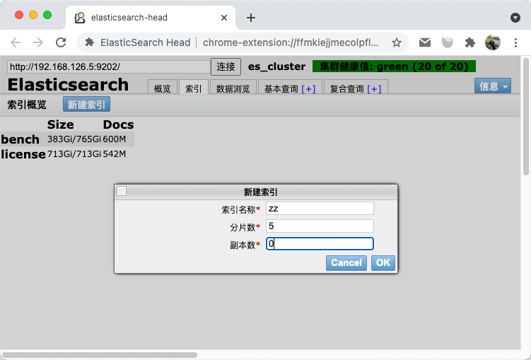
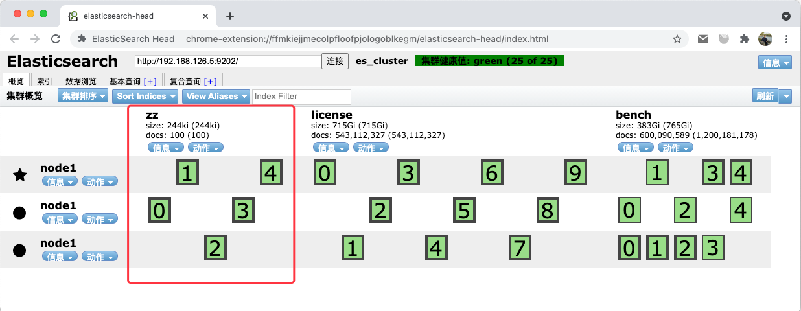
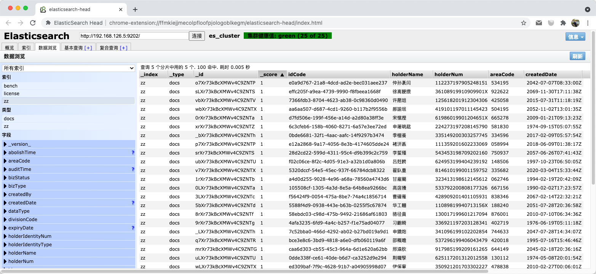

# es 数据导出

Elasticsearch 经典分页问题
直接破题 Elasticsearch 只能接受 from+size 小于等于 index.max_result_window, default = 10000
可以想像工人是因为性能问题的限制，可以在使用中避免使用 RMSDB(MySQL, PostgreSQL..) 也可以参考文章使用类似的方式(offset, limt)进行分页，避免性能降低的问题

## 新建索引



## 创建100条随机数据

`gobench -l "192.168.126.5:9202/zz/docs?routing=@身份证_keep" -P @es.json -n100 -p1`

es.json

```json
{
  "idCode": "@uuid",
  "holderName": "@姓名",
  "holderNum": "@身份证_keep",
  "areaCode": "@regex([0-9]{6})",
  "createdDate": "@random_time(yyyy-MM-ddTHH:mm:ssZ)"
}
```





## 滚动 API

1. 全部属性： `curl -XGET "192.168.126.5:9202/zz/docs/_search?scroll=1m" -H 'Content-Type:application/json' -d '{"size":5}'`
1. 指定属性： `curl -XGET "192.168.126.5:9202/zz/docs/_search?scroll=1m" -H 'Content-Type:application/json' -d '{"size":5,"_source":["idCode"]}'`

```json
{"_scroll_id":"DnF1ZXJ5V...b2c5WlNB","took":33,"timed_out":false,"_shards":{"total":5,"successful":5,"skipped":0,"failed":0},
  "hits":{"total":100,"max_score":1.0,"hits":[
    {"_index":"zz","_type":"docs","_id":"o7Xr73kBcXMWv4C9ZNTP","_score":1.0,"_routing":"112237197905248151",
      "_source":{"idCode":"e0a9d767-21a8-4dcd-ad2e-bec031aee237","holderName":"仲孙袲闫","holderNum":"112237197905248151","areaCode":"534195","createdDate":"2042-07-07T08:33:00Z"}},
    {"_index":"zz","_type":"docs","_id":"sLXr73kBcXMWv4C9ZNTS","_score":1.0,"_routing":"36108919910909901X",
      "_source":{"idCode":"effc205f-a9ea-4739-9990-f8fbeea1668f","holderName":"徐离骾缵","holderNum":"36108919910909901X","areaCode":"922622","createdDate":"2069-11-30T17:11:38Z"}},
    {"_index":"zz","_type":"docs","_id":"vbXr73kBcXMWv4C9ZNTV","_score":1.0,"_routing":"125618201912304306",
      "_source":{"idCode":"7366fdb3-8704-4623-ab38-0c98360d0490","holderName":"许懕俎","holderNum":"125618201912304306","areaCode":"425058","createdDate":"2015-07-31T11:18:19Z"}},
    {"_index":"zz","_type":"docs","_id":"wbXr73kBcXMWv4C9ZNTX","_score":1.0,"_routing":"419101197011145423",
      "_source":{"idCode":"aa6aa507-d687-4cd1-9260-b117b2f9556b","holderName":"郝諭垊","holderNum":"419101197011145423","areaCode":"504195","createdDate":"2052-11-02T13:01:35Z"}},
    {"_index":"zz","_type":"docs","_id":"0rXr73kBcXMWv4C9ZNTa","_score":1.0,"_routing":"61986019901204651X",
      "_source":{"idCode":"d7fd506e-199f-456e-a14d-a2d80a38ff3e","holderName":"宋憱摼","holderNum":"61986019901204651X","areaCode":"665278","createdDate":"2009-01-21T09:13:23Z"}}]}}
```

1. 反复滚动：`curl -XGET "192.168.126.5:9202/_search/scroll" -H"Content-Type:application/json" -d '{"scroll_id":"DnF1ZXJ5V...b2c5WlNB","scroll":"1m"}'`

```json
{"_scroll_id":"DnF1ZXJ5V...b2c5WlNB","took":9,"timed_out":false,"terminated_early":true,"_shards":{"total":5,"successful":5,"skipped":0,"failed":0},
  "hits":{"total":100,"max_score":1.0,"hits":[
    {"_index":"zz","_type":"docs","_id":"v7Xr73kBcXMWv4C9ZNTX","_score":1.0,"_routing":"814610199001159752",
      "_source":{"idCode":"5320dccf-54e5-45ec-937f-66784dcb8322","holderName":"翟釞重","holderNum":"814610199001159752","areaCode":"335682","createdDate":"2020-03-04T15:33:44Z"}},
    {"_index":"zz","_type":"docs","_id":"1rXr73kBcXMWv4C9ZNTb","_score":1.0,"_routing":"323413198612145612",
      "_source":{"idCode":"a4d0d255-9028-4e96-a68a-78560a4743d6","holderName":"甘雇飋","holderNum":"323413198612145612","areaCode":"062746","createdDate":"1994-02-19T20:42:09Z"}},
    {"_index":"zz","_type":"docs","_id":"0LXr73kBcXMWv4C9ZNTa","_score":1.0,"_routing":"533792200808177326",
      "_source":{"idCode":"105508cf-1305-4a3d-8e5a-64b8ea9266bc","holderName":"高扂攁","holderNum":"533792200808177326","areaCode":"667156","createdDate":"1990-02-02T17:23:57Z"}},
    {"_index":"zz","_type":"docs","_id":"3LXr73kBcXMWv4C9ZNTc","_score":1.0,"_routing":"428909201401105931",
      "_source":{"idCode":"f56424f9-0054-475a-8be7-74a4c1856714","holderName":"曹礶罹","holderNum":"428909201401105931","areaCode":"838346","createdDate":"2067-02-14T22:32:21Z"}},
    {"_index":"zz","_type":"docs","_id":"5bXr73kBcXMWv4C9ZNTd","_score":1.0,"_routing":"11089819940713156X",
      "_source":{"idCode":"5588f4d9-0938-443e-b63b-0255f5c67874","holderName":"华工輣","holderNum":"11089819940713156X","areaCode":"188240","createdDate":"2051-07-28T20:36:58Z"}}
  ]}}
```

```json
{"_scroll_id":"DnF1ZXJ5V...b2c5WlNB","took":6,"timed_out":false,"terminated_early":true,"_shards":{"total":5,"successful":5,"skipped":0,"failed":0},
  "hits":{"total":100,"max_score":1.0,"hits":[]}}
```

简介一下 Scroll API 的使用方式

1. 第1步：在搜索中加上scroll并传递给生命周期。（官方范例是`scroll=1m`，即scroll有效时间`1分钟`）
1. 第2步：使用在 第1步 得到的 scroll_id 视为参数继续往下搜索，同时更新生命周期（可选）

## 资料

1. [Elasticsearch Scroll API](https://medium.com/@cc.donn/elasticsearch-scroll-api-751fb07e564d)
1. [Using the Elasticsearch scroll API](https://gist.github.com/cb372/4567f624894706c70e65)
1. [search-request-scroll](https://www.elastic.co/guide/en/elasticsearch/reference/6.8/search-request-scroll.html)
